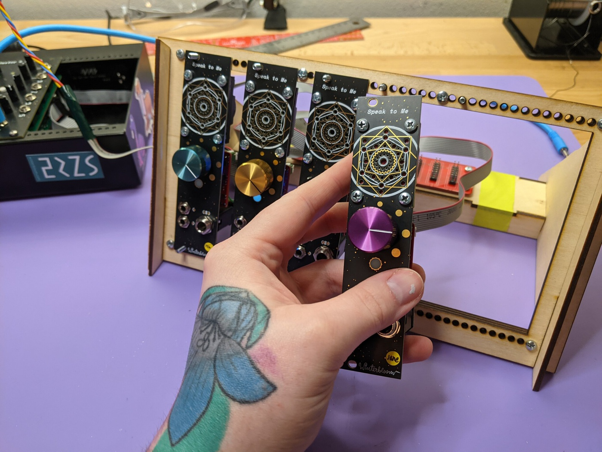

# 🍪 Gingerbread

*Gingerbread* is a set of Python utilities used by [Winterbloom](https://winterbloom.com) to create decorative printed circuit boards (PCBs), such as the ones we used a front panels:



Gingerbread consists of three utilities:

* [`convert`](#using-convert) helps convert designs created with [Affinity Designer](https://affinity.serif.com/en-gb/designer/) to KiCAD PCB files.
* [`fancytext`](#using-fancytext) is used to generate beautiful text labels for KiCAD PCBs.
* [`trace`](#using-trace) is a re-implementation of KiCAD's "Image Converter" program ([bitmap2component](https://gitlab.com/kicad/code/kicad/-/tree/master/bitmap2component)) as a Python library and command line tool to enable automation.

**NOTE**: This tool is *extremely* tailored to Winterbloom's needs. It's not perfect, it's not universal, and it probably won't work the way you think it will. Because of this, it comes with no warranty and no promise of support- again, **we won't be providing any free support for this.**

That said, you're welcome to try it out, learn from it, take code from it, and give us feedback or even [contribute](#contributing) if you'd like. If you'd like to pay us to add a feature or support some use case, [reach out](thea@winterbloom.com).

There are several [similar projects](#similar-projects) that might fit your use case better.


## Installation

Presently we've only ever tested on macOS and Linux. It might be tricky to get working regardless of platform, and it probably doesn't work on Windows except under WSL. There's a [Docker option](#docker), but it has some drawbacks.

### macOS

You'll need [homebrew](https://brew.sh) and a few dependencies:

```sh
brew install cairo pango pangocairo potrace
```

You'll also need Python 3.10 or later. Install using `pip`:

```sh
python3 -m pip install gingerbread
```

### Linux / WSL

At the time of writing, Ubuntu 22.04 or later is your best bet. If you want to use Debian, you'll need to build [Python 3.10](https://realpython.com/installing-python/#how-to-build-python-from-source-code) or later and pango 1.50 or later, since the current versions are behind. This *should* work under WSL (Windows Subsystem for Linux), just be sure to use Ubuntu 22.04 or later.

You'll need at least the following system packages:

```sh
sudo apt install -y \
    build-essential \
    cmake \
    libpotrace-dev \
    libvips-dev \
    libcairo2 \
    libpango1.0-0 \
    libpangocairo-1.0-0 \
    libvips42
```

Once you have the requisites installed, you can install Gingerbread:

```sh
python3 -m pip install --user gingerbread
```

### Docker

There's a rough Docker version of Gingerbread that you can use if all else fails. From our limited testing, `convert` works okay (although a bit slower), but `fancytext` does not work at all.

To use the Docker version, clone this repo:

```sh
git clone https://github.com/wntrblm/Gingerbread.git
cd Gingerbread
```

Build the image- we don't publish it to Dockerhub because it's experimental:

```sh
docker build -t gingerbread .
```

You can now run Gingerbread using Docker. You'll need to pass the current working directory as a volume so that Gingerbread can read and write files. You can test this out on the included example file:

```sh
cd example
docker run --rm -v "$PWD":/workdir gingerbread -m gingerbread.convert example.svg
```


## Using convert

`convert` is designed to convert designs created with [Affinity Designer](https://affinity.serif.com/en-gb/designer/) to KiCAD PCB files. `convert` requires a bit of work to set up, but once working you can rapidly iterate on your design.

There's an example in the `./example` directory, including the source `afdesign` file, the exported `svg`, and the generated `kicad_pcb`. It might be useful to look at the example as you work through these docs.


### Page settings

It's *highly recommended* to set up your document in Affinity to use millimeters and to have a DPI of `2540`:


Why that specific DPI? Well, 2540 DPI happens to be 1000 dots-per-mm, which helpfully avoids rounding issues when exporting the design from Affinity and when converting the outline and drills. You can use other DPIs, just be sure to tell `convert` using the `--dpi` flag.


### Creating an outline

The outline should be drawn on a layer named `Edge.Cuts` (or `EdgeCuts`) in Affinity. `convert` handles `Edge.Cuts` in a specific way to make sure that there is a 1-to-1 match between the size and units in Affinity and KiCAD. This approach can't handle as many complex edge cases as the rasterization approach used by the graphic layers, but as long as your paths have been converted to curves it should handle them well. `Edge.Cuts` can also contain "cut-outs"- closed paths within the overall board shape.

The example file has a complex outline with four internal cut-outs.


### Graphics layers

Non-transparent areas on layers `F.SilkS`, `B.SilkS`, `F.Cu`, and `B.Cu` in Affinity are converted as-is to the respective layers in KiCAD. `F.Mask` and `B.Mask` are "inverted" like they are in KiCAD, meaning that non-transparent areas indicate where to *remove* the soldermask. For all of these layers, `convert` works by rasterizing the individual layers to black and white images, re-vectorizing using `trace`, and plotting the results as a KiCAD footprint.

The example file has graphics on the `F.SilkS`, `F.Cu`, and `F.Mask` layers.


### Drills

Items on the `Drills` layer are handled seperately as well. `convert` walks through all of the shapes in the `Drills` layer and converts **only** circles to drills. This is again done to preserve position and size between Affinity and KiCAD.

The example file has a single drill in the center.


### Exporting the design

When exporting the design to an SVG, click the *More* button and setup the export parameters. Make sure that *Rasterize* is set to "Nothing", *Export text as curves* is checked, and *Flatten transforms* is checked.


You can save this as a preset to avoid having to change these every time you export.


### Running convert

Once the design is exported as an SVG, you can run `convert` to turn it into a KiCAD PCB:

```sh
python3 -m gingerbread.convert design.svg
```

`convert` will report details about the converted PCB. Double-check this output to make sure that things match up with what you expect. For example. running convert on the example design shows:

```
convert: Converting board outline
convert: Outline converted: overall board size is 100.00 mm x 100.00 mm (10000.00 mm²).
convert: Converting drills
convert: Drills converted: 1
convert: Converting graphic layers
convert: F.SilkS    converted
convert: B.SilkS    not found
convert: F.Cu       converted
convert: B.Cu       not found
convert: F.Mask     converted
convert: B.Mask     not found
convert: Writing...
convert: Written to example.kicad_pcb 💜
```

`convert` has a several options for customizing the conversion process and the output. Run `python3 -m gingerbread.convert --help` to get a full list of options.


## Using fancytext

`fancytext` is intended to be relatively easy to use. It's a terminal application that copies the resulting label to your clipboard.

The most basic example is:

```sh
python3 -m gingerbread.fancytext "example"
```

Which will generate a simple text label:


This rudimentary example isn't much more useful than KiCAD's own text facilities, but Fancytext gives you much more control.

You can change various aspects of how the text is rendered:

```sh
python3 -m gingerbread.fancytext --font "Pluto" --italic --size 3 "example"
```


You can run `python3 -m gingerbread.fancytext --help` to get a complete list of options.

Fancytext has another fancy trick- outlines. You can use outlines to call more attention to your text labels. There are various outline styles, starting with `--outline-stroke`:

```sh
python3 -m gingerbread.fancytext --outline-stroke 0.5 "example"
```


There's also the more eye-catching `--outline-fill`:

```sh
python3 -m gingerbread.fancytext --outline-fill --outline-stroke 0.2 "example"
```


The shape of the end caps can be changed by wrapping your text in `[]`, `||`, `<>`, `()`, `//`, or `\\`, and you can mix and match:

```sh
python3 -m gingerbread.fancytext --outline-fill --outline-stroke 0.2 "/example>"
```


There are *lots* of options for customizing the look of these labels. You can run `python3 -m gingerbread.fancytext --help` to get a complete list of options. As an example, we like using these settings for our labels:

```sh
python3 -m gingerbread.fancytext --font "Space Mono" --bold --italic --stroke 0.1 --padding 0 0 --outline-stroke 0.2 --outline-fill "fancytext"
```

Which ends up looking like this:


## Using trace

`trace` is fairly straightforward compared to the other tools in Gingerbread. Provide it with an image and it will provide you with a KiCAD footprint:

```sh
python3 -m gingerbread.trace footprint.png
```

There's several options for `trace`, including the important `--dpi` option which tells `trace` the physical size that the footprint should be. Run `python3 -m gingerbread.trace --help` see all options.


## Similar projects

Projects similar to Gingerbread's `convert`:
- [svg2shenzhen](https://github.com/badgeek/svg2shenzhen) is an Inkscape-based tool for creating PCBs and footprints from SVGs. Gingerbread shares a lot in common with svg2shenzhen's inner workings, but svg2shenzhen is much more broadly used and handles more use cases.
- [Gerbolyze](https://github.com/jaseg/gerbolyze) renders both vector and raster artwork onto existing Gerber files. This is a very different approach than the one taken by Gingerbread and svg2shenzhen and can produce some incredible results through its grayscale emulation.
- [PCBmodE](https://boldport.com/pcbmode) is a circuit board design program built on Inkscape.

Projects similar to Fancytext:
- [KiBuzzard](https://github.com/gregdavill/KiBuzzard) creates beautiful text labels. Fancytext is actually inspired by and inherits many stylistic choices from Buzzard. However, they differ in their implementation - Buzzard is vector graphics all the way through, whereas Fancytext has an intermediary rasterization step. KiBuzzard is also a KiCAD plugin with a GUI whereas Fancytext is (presently) a terminal application.


## Acknowledgements

Gingerbread sits on the shoulders of the incredible work of other open source projects:

- [cairosvg](https://cairosvg.org/) is used by `convert` to rasterize SVG files.
- [cairo](https://www.cairographics.org/) (via [cairocffi](https://cairocffi.readthedocs.io/en/stable/)) is used by both `convert` and `fancytext` to render 2d graphics.
- [pango](https://pango.gnome.org/) (via [pangocffi](https://pangocffi.readthedocs.io/en/stable/)) is used by `fancytext` to layout text.
- [svgpathtools](https://github.com/mathandy/svgpathtools) is used by `convert` to process the board outline.
- [rich](https://rich.readthedocs.io/en/stable/introduction.html) is used throughout for pretty terminal output.
- [pyperclip](https://github.com/asweigart/pyperclip) is used to copy stuff to your clipboard.
- [numpy](https://numpy.org/) is used extensively to shuffle data around between various libraries.
- [vips](https://www.libvips.org/) (via [pyvips](https://libvips.github.io/pyvips/)) is used for processing images efficiently.
- [potrace](http://potrace.sourceforge.net/) (via [potracecffi](https://github.com/wntrblm/potracecffi)) is used in `trace` for converting raster images to polygons.
- [Gdsdk](https://heitzmann.github.io/gdstk/) and the underlying [Clipper](http://www.angusj.com/delphi/clipper/documentation/Docs/Overview/_Body.htm) library are used to wrangle polygons and punch holes in them.

Additionally, information and ideas from the following projects were used when building Gingerbread:

- [svg2shenzhen](https://github.com/badgeek/svg2shenzhen)'s overall strategy for converting SVGs to KiCAD PCBs served as the starting point for Gingerbread's `convert`.
- [pangocairocffi's tests](https://pangocairocffi.readthedocs.io/en/latest/tests.html) were used as a starting point when implementing `fancytext`'s text layout.
- [librsvg's text.rs](https://gitlab.gnome.org/GNOME/librsvg/-/blob/main/src/text.rs#L1219w) was used as a reference for implementing `fancytext`'s text layout.
- KiCAD's [bitmap2component](https://gitlab.com/kicad/code/kicad/-/tree/master/bitmap2component) was used as a reference for implementing `trace` and for testing its output.
- KiCAD's [kimath](https://gitlab.com/kicad/code/kicad/-/tree/master/libs/kimath) was used as a reference for implementing `trace`'s polygon handling.
- KiCAD's [S-Expression reference](https://dev-docs.kicad.org/en/file-formats/sexpr-intro/).


## Contributing

Because this tool is so specifically tailored to Winterbloom's workflow, we aren't really expecting a lot of outside contributions. However, if you'd like to contribute please file an issue or reach out to us before you start writing code, so we can make sure it's something that'll be beneficial for all of us. :)


## License

Gingerbread is published under the [MIT License](LICENSE)
