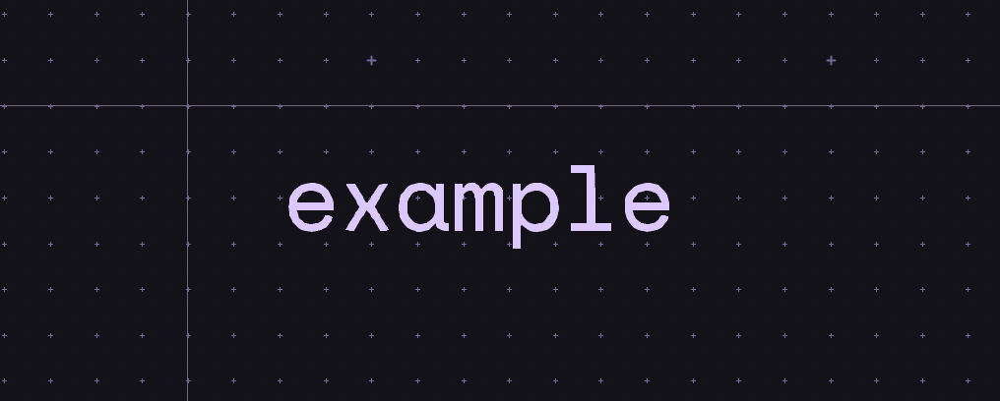
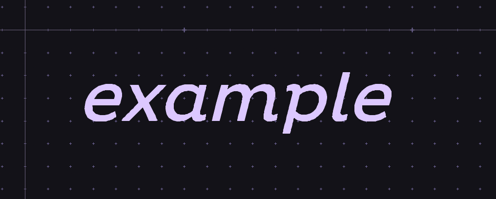
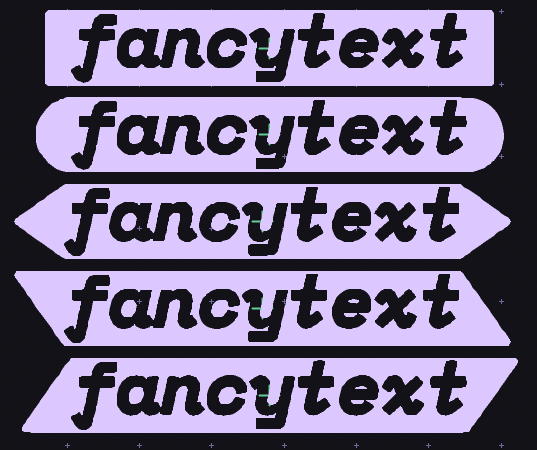

# Gingerbread

*Gingerbread* is a set of Python utilities used by [Winterbloom](https://winterbloom.com) to create decorative printed circuit boards (PCBs).

Gingerbread consists of three utilities:

* [Affinity2KiCAD](#using-affinity2kicad) helps convert designs created with [Affinity Designer](https://affinity.serif.com/en-gb/designer/) to KiCAD PCB files.
* [Fancytext](#using-fancytext) is used to generate beautiful text labels for KiCAD PCBs.
* [Trace](#using-trace) is a re-implementation of KiCAD's "Image Converter" program ([bitmap2component](https://gitlab.com/kicad/code/kicad/-/tree/master/bitmap2component)) as a Python library and command line tool to enable automation.

**NOTE**: This tool is *extremely* tailored to Winterbloom's needs. It's not perfect, it's not universal, and it probably won't work the way you think it will. Because of this, it comes with no warranty and no promise of support- again, **we won't be providing any free support for this.**

That said, you're welcome to try it out, learn from it, take code from it, and give us feedback or even [contribute](#contributing) if you'd like. If you'd like to pay us to add a feature or support some use case, [reach out](thea@winterbloom.com).

There are several [similar projects](#similar-projects) that might fit your use case better.

## Installation

Presently we've only ever tested on macOS. It'll probably work on Linux, and will probably be a pain in the ass to get working on Windows.

### macOS

You'll need [homebrew](https://brew.sh) and a few dependencies:

```sh
brew install cairo pango pangocairo potrace
```

You'll also need Python 3.10 or later. Install using `pip`:

```sh
python3 -m pip install gingerbread
```

## Using Affinity2KiCAD

TODO. :3

## Using Fancytext

Fancytext is intended to be relatively easy to use. It's a terminal application that copies the resulting label to your clipboard.

The most basic example is:

```sh
python3 -m gingerbread.fancytext "example"
```

Which will generate a simple text label:



This rudimentary example isn't much more useful than KiCAD's own text facilities, but Fancytext gives you much more control.

You can change various aspects of how the text is rendered:

```sh
python3 -m gingerbread.fancytext --font "Pluto" --italic --size 3 "example"
```



You can run `python3 -m gingerbread.fancytext --help` to get a complete list of options.

Fancytext has another fancy trick- outlines. You can use outlines to call more attention to your text labels. There are various outline styles, starting with `--outline-stroke`:

```sh
python3 -m gingerbread.fancytext --outline-stroke 0.5 "example"
```


There's also the more eye-catching `--outline-fill`:

```sh
python3 -m gingerbread.fancytext --outline-fill --outline-stroke 0.2 "example"
```


The shape of the end caps can be changed by wrapping your text in `[]`, `||`, `<>`, `()`, `//`, or `\\`, and you can mix and match:

```sh
python3 -m gingerbread.fancytext --outline-fill --outline-stroke 0.2 "/example>"
```


There are *lots* of options for customizing the look of these labels. You can run `python3 -m gingerbread.fancytext --help` to get a complete list of options. As an example, we like using these settings for our labels:

```sh
python3 -m gingerbread.fancytext --font "Space Mono" --bold --italic --stroke 0.1 --padding 0 0 --outline-stroke 0.2 --outline-fill "fancytext"
```

Which ends up looking like this:




## Using Trace

TODO

## Similar projects

Projects similar to Affinity2KiCAD:
- [svg2shenzhen](https://github.com/badgeek/svg2shenzhen) is an Inkscape-based tool for creating PCBs and footprints from SVGs. Affinity2KiCAD shares a lot in common with svg2shenzhen's inner workings, but svg2shenzhen is much more broadly used.
- [Gerbolyze](https://github.com/jaseg/gerbolyze) renders both vector and raster artwork onto existing Gerber files. This is a very different approach than the one taken by Affinity2KiCAD and svg2shenzhen and can produce some incredible results through its grayscale emulation.

Projects similar to Fancytext:
- [KiBuzzard](https://github.com/gregdavill/KiBuzzard) creates beautiful text labels. Fancytext is actually inspired by and inherits many stylistic choices from Buzzard. However, they differ in their implementation - Buzzard is vector graphics all the way through, whereas Fancytext has an intermediary rasterization step. KiBuzzard is also a KiCAD plugin with a GUI whereas Fancytext is (presently) a terminal application.

## Contributing

Because this tool is so specifically tailored to Winterbloom's workflow, we aren't really expecting a lot of outside contributions. However, if you'd like to contribute please file an issue or reach out to us before you start writing code, so we can make sure it's something that'll be beneficial for all of us. :)

## License

Affinity2KiCAD is published under the [MIT License](LICENSE)
